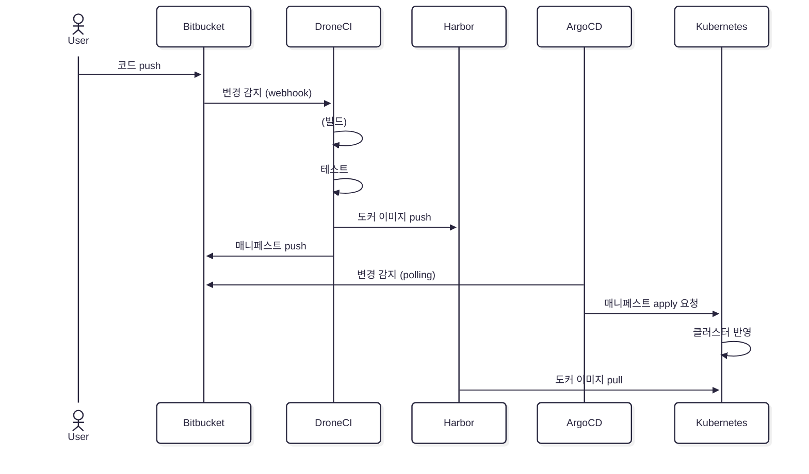

```mermaid
architecture-beta
    %% Network Infrastructure Groups
    group office_network(logos:aws-vpc)[Office Network]
    %% group tunnel_layer(mdi:cloud)[IPsec Tunnel Layer]
    group idc_network(logos:aws-vpc)[IDC Network]
    group kubernetes_cluster(logos:kubernetes)[Kubernetes Cluster] in idc_network
    group kubernetes_nodes(logos:kubernetes)[Kubernetes Nodes] in kubernetes_cluster
    
    %% Office Infrastructure
    service office_fortigate(simple-icons:fortinet)[Fortigate AS64512] in office_network
    service office_devices(mdi:lan)[Office Subnet 10_224_64_0] in office_network
    
    %% Tunnel Infrastructure
    service tunnel_interface_hq(mdi:tunnel)[Tunnel Interface 10_100_0_2] %%in tunnel_layer
    service tunnel_interface_idc(mdi:tunnel)[Tunnel Interface 10_100_0_1] %%in tunnel_layer
    
    %% IDC Infrastructure
    service idc_fortigate(simple-icons:fortinet)[Fortigate AS64520] in idc_network
    service idc_devices(mdi:lan)[IDC Subnet] in idc_network
    
    %% Kubernetes Infrastructure
    %% service k8s_nodes(logos:kubernetes)[Kubernetes Nodes AS64520] in kubernetes_cluster
    service cilium_bgp(simple-icons:cilium)[Cilium BGP AS64520] in kubernetes_cluster
    service pod_network(carbon:web-services-container)[Pod Network 10_10_0_0] in kubernetes_nodes
    service service_network(carbon:container-services)[Service Network 10_20_0_0] in kubernetes_nodes
    
    %% Network Connections
    office_devices:T -- B:office_fortigate
    office_fortigate:R -- L:tunnel_interface_hq
    tunnel_interface_hq:R <--> L:tunnel_interface_idc
    tunnel_interface_idc:R -- L:idc_fortigate
    idc_fortigate:R -- L:idc_devices

    %% BGP Peering Connections
    %% tunnel_interface_hq:B --> T:tunnel_interface_idc
    idc_fortigate:B -- T:cilium_bgp
    
    %% Kubernetes Internal Connections
    %% k8s_nodes:B -- T:cilium_bgp
    cilium_bgp:B -- T:pod_network
    cilium_bgp:B -- T:service_network

```

```dataviewjs 
const mermaid = window.mermaid; 
await mermaid.registerIconPacks([ 
{ name: 'logos', loader: () => fetch('https://unpkg.com/@iconify-json/logos@1/icons.json') .then((res) => res.json()), }, 
{ name: 'mdi', loader: () => fetch('https://unpkg.com/@iconify-json/mdi@1/icons.json') .then((res) => res.json()), }, 
{ name: 'simple-icons', loader: () => fetch('https://unpkg.com/@iconify-json/simple-icons@1/icons.json') .then((res) => res.json()), }, 
{ name: 'carbon', loader: () => fetch('https://unpkg.com/@iconify-json/carbon@1/icons.json') .then((res) => res.json()), }, 
]); 
```


<!-- QueryToSerialize:  
const mermaid = window.mermaid; 
await mermaid.registerIconPacks([ 
{ name: 'logos', loader: () => fetch('https://unpkg.com/@iconify-json/logos@1/icons.json') .then((res) => res.json()), }, 
{ name: 'mdi', loader: () => fetch('https://unpkg.com/@iconify-json/mdi@1/icons.json') .then((res) => res.json()), }, 
{ name: 'simple-icons', loader: () => fetch('https://unpkg.com/@iconify-json/simple-icons@1/icons.json') .then((res) => res.json()), }, 
{ name: 'carbon', loader: () => fetch('https://unpkg.com/@iconify-json/carbon@1/icons.json') .then((res) => res.json()), }, 
]); -->


