## 🚀 요약
> [!SUMMARY]
> <b>Fortigate</b> 장비 간 <b>IPsec</b> 터널 인터페이스에 IP를 할당하고, <b>BGP Peering</b>을 설정하여 Kubernetes의 Pod/Service CIDR를 사무실 네트워크에 전파했다. <b>Cilium</b>의 BGP 기능을 활성화하여 클러스터 네트워크 정보를 동적으로 라우팅 테이블에 추가함으로써, 별도 설정 없이 내부망에서 Pod와 서비스에 직접 접근할 수 있었다.

## ⚙️ 환경
- <b>UTM</b>: Fortigate 60E (v5.6.8)
- <b>CNI</b>: Cilium 1.17.4
- <b>Kubernetes</b>: 1.32.6
- <b>네트워크 구성</b>
    - <b>본사</b>: 10.224.64.0/22
    - <b>IDC</b>: 172.16.20.0/24
    - <b>Pod CIDR</b>: 10.10.0.0/16
    - <b>Service CIDR</b>: 10.20.0.0/16

## 💬 이슈
Kubernetes 클러스터의 Pod 및 Service 네트워크는 기본적으로 클러스터 내부에서만 접근이 가능하다. 외부에서 접근하려면 <b>로드밸런서(LoadBalancer)</b>나 <b>인그레스(Ingress)</b> 같은 리소스를 별도로 설정해야 한다.

하지만 현재 구성 중인 클러스터는 개발 및 테스트 목적이 강했기 때문에, 사무실에서 개발자들이 Port Forwarding 같은 번거로운 작업 없이 Pod나 Service IP로 직접 접근할 수 있는 환경을 만들고 싶다고 판단했다. 즉, <b>별도의 Kubernetes 리소스 생성 없이 사무실 PC에서 `curl 10.10.1.23:8080`과 같은 명령이 동작</b>하도록 만드는 것이 목표였다.

## 🧗 해결
사무실 네트워크와 IDC에 있는 Kubernetes 클러스터 네트워크를 연결하기 위해 <b>BGP(Border Gateway Protocol)</b>를 사용하기로 결정했다.

### 1. BGP를 선택한 이유

기존에 사용하던 <b>정적 라우팅(Static Routing)</b> 방식은 관리자가 모든 경로를 라우터에 직접 입력해야 했다. Kubernetes 환경에서는 노드가 추가되거나 Pod IP 대역이 변경될 때마다 라우팅 테이블을 수동으로 수정해야 하므로, 관리 부담이 크고 실수가 발생할 여지가 많다고 판단했다.

반면, <b>BGP</b>는 <b>동적 라우팅 프로토콜(Dynamic Routing Protocol)</b>로, 라우터 간에 네트워크 경로 정보를 자동으로 교환한다. Cilium의 BGP 기능을 활용하면, Kubernetes 클러스터의 네트워크(Pod CIDR, Service IP) 정보를 동적으로 Fortigate 라우터에 <b>전파(Advertise)</b>할 수 있다. 이를 통해 네트워크 변경 사항이 발생해도 수동 개입 없이 라우팅이 자동으로 업데이트되므로, 확장성과 운영 효율성 측면에서 BGP가 훨씬 유리하다고 보았다.

무엇보다 BGP에 대한 지식이 부족했기에, 이번 기회에 직접 부딪혀보며 학습하고 싶다는 동기가 가장 크게 작용했다고 할 수 있다.

### 2. Fortigate 설정

#### IPsec 터널 인터페이스 IP 할당
먼저, 사무실과 IDC 간의 IPsec 터널에 BGP 연동을 위한 인터페이스 IP를 할당했다. 이 작업은 GUI에서는 불가능하여 CLI로 진행했다.

> [!NOTE]
> Fortigate는 GUI가 매우 편리하지만, 세부적인 네트워크 설정을 하려면 결국 CLI를 사용해야 하는 경우가 많다는 것을 경험적으로 느꼈다.

- <b>사무실 Fortigate (`10.100.0.1`)</b>
```shell
# config system interface
    edit "to IDC"
        set ip 10.100.0.1 255.255.255.255
        set allowaccess ping
        set type tunnel
        set remote-ip 10.100.0.254 255.255.255.0
        set interface "wan1"
    next
end
```
위 설정은 `to IDC`라는 이름의 터널 인터페이스에 IP `10.100.0.1`을 할당하는 명령어다.

- <b>IDC Fortigate (`10.100.0.2`)</b>
```shell
# config system interface
	edit "to HQ"
        set ip 10.100.0.2 255.255.255.255
        set allowaccess ping
        set type tunnel
        set remote-ip 10.100.0.1 255.255.255.255
        set interface "wan1"
    next
end
```
IDC 장비에도 마찬가지로 `to HQ` 터널 인터페이스에 IP `10.100.0.2`를 할당했다.

#### BGP 설정
사설 AS(Autonomous System) 번호를 본사는 `64512`, IDC와 Kubernetes 클러스터는 `64520`으로 통일하여 설정했다.

- <b>IDC Fortigate</b>
```shell
# config router bgp
    set as 64520
    set router-id 10.100.0.2
    config neighbor
        # 본사 Fortigate 와의 eBGP 설정
        edit "10.100.0.1"
            set soft-reconfiguration enable
            set remote-as 64512
            set update-source "to HQ"
        next
    end
    config neighbor-group
        # Kubernetes 노드들과의 iBGP 설정
        edit "sf-peers"
            set remote-as 64520
            set route-reflector-client enable
        next
    end
    config neighbor-range
        # Kubernetes 노드 대역을 neighbor-group 으로 묶어 한번에 처리
        edit 1
            set prefix 172.16.20.0 255.255.255.0
            set neighbor-group "sf-peers"
        next
    end
    config network
        # BGP를 통해 광고할 네트워크 대역
        edit 1
            set prefix 10.220.96.0 255.255.252.0
        next
    end
    # 다른 라우팅 프로토콜로부터 경로를 가져와 BGP로 재분배
    config redistribute "connected"
    end
    config redistribute "static"
    end
end
```
IDC Fortigate는 본사 Fortigate와 <b>eBGP</b> 관계를, Kubernetes 노드들과는 <b>iBGP</b> 관계를 맺는다. 특히 `route-reflector-client` 옵션을 활성화했는데, 이는 iBGP 피어(Kubernetes 노드들)들이 서로 Full-Mesh로 연결되지 않아도 라우팅 정보를 교환할 수 있게 해주는 중요한 설정이라고 판단했다.

- <b>본사 Fortigate</b>
```shell
# config router bgp
    set as 64512
    set router-id 10.100.0.1
    config neighbor
        edit "10.100.0.2"
            set soft-reconfiguration enable
            set remote-as 64520
            set update-source "to Mokdong" # IDC 로 향하는 터널 인터페이스
        next
    end
    config network
        edit 1
            set prefix 10.224.64.0 255.255.192.0
        next
    end
    config redistribute "connected"
    end
    config redistribute "static"
    end
end
```
본사 Fortigate는 IDC Fortigate(`10.100.0.2`)를 BGP 피어로 등록하여 경로 정보를 수신하도록 설정했다.

### 3. Cilium BGP 설정
Cilium에서 BGP를 활성화하고, Kubernetes 리소스(Pod, Service)의 네트워크 정보를 IDC Fortigate로 전파하도록 설정했다.

- <b>CiliumBGPClusterConfig</b> - 클러스터 전역 BGP 설정을 정의한다.
```yaml
apiVersion: cilium.io/v2alpha1
kind: CiliumBGPClusterConfig
metadata:
  name: cilium-bgp
spec:
  bgpInstances:
  - localASN: 64520
    name: instance-64520
    peers:
    - name: peer-64520-fortigate
      peerASN: 64520
      peerAddress: 172.16.20.1 # IDC Fortigate의 내부 IP
      peerConfigRef:
        group: cilium.io
        kind: CiliumBGPPeerConfig
        name: cilium-peer
```
Kubernetes 클러스터의 `localASN`을 `64520`으로 설정하고, 동일한 AS에 속한 IDC Fortigate(`172.16.20.1`)를 iBGP 피어로 등록했다.

- <b>CiliumBGPPeerConfig</b> - BGP 피어의 상세 옵션을 설정한다.
```yaml
apiVersion: cilium.io/v2alpha1
kind: CiliumBGPPeerConfig
metadata:
  name: cilium-peer
spec:
  families:
  - afi: ipv4
    safi: unicast
  gracefulRestart:
    enabled: true
    restartTimeSeconds: 120
```
IPv4 유니캐스트 주소 체계를 사용하고, BGP 세션이 끊겼을 때 잠시 동안 기존 경로를 유지하는 `gracefulRestart` 기능을 활성화했다.

- <b>CiliumBGPAdvertisement</b> - 어떤 네트워크 대역을 외부에 알릴지(전파할지) 정의한다.
```yaml
apiVersion: cilium.io/v2alpha1
kind: CiliumBGPAdvertisement
metadata:
  name: bgp-advertisements
spec:
  advertisements:
  - advertisementType: PodCIDR
  - advertisementType: Service
    service:
      addresses:
      - ClusterIP
```
이 설정을 통해 Cilium은 <b>Pod CIDR</b>와 <b>ClusterIP</b> 타입의 Service 주소 대역을 BGP를 통해 피어에게 전파한다.

### 4. 방화벽 정책 추가
마지막으로 Fortigate에서 BGP 통신(TCP 179번 포트) 및 ICMP가 원활하게 이루어질 수 있도록 방화벽 정책을 추가했다. 특히 <b>내부(LAN)에서 터널 인터페이스로 나가는 정책</b>에서 BGP를 허용하지 않으면 피어링이 맺어지지 않으므로 주의가 필요하다는 것을 경험적으로 깨달았다.

## ✅ 확인
설정이 완료된 후, 아래 명령어들을 사용하여 BGP 세션 상태와 라우팅 정보가 정상적으로 교환되는지 확인했다.

다음은 내가 주로 사용한 확인 명령어들이다.

<b>Fortigate에서 BGP 상태 확인</b>
```shell
# IPsec 터널 상태 확인
diagnose vpn ike gateway list

# BGP neighbor 상태 및 수신 경로 확인
get router info bgp neighbors <neighbor_ip> received-routes

# 특정 BGP neighbor 에게 전파한 경로 확인
get router info bgp neighbors <neighbor_ip> advertised-routes

# 라우팅 테이블 전체 확인
get router info routing-table all

# 특정 목적지에 대한 상세 라우팅 경로 확인
get router info routing-table details <destination_network/mask>

# 특정 Pod IP로 패킷 추적
diagnose sniffer packet any 'host <pod_ip>' 4
```
`received-routes` 명령어를 통해 Cilium으로부터 Pod/Service CIDR가 정상적으로 수신되었는지 확인하는 것이 핵심이라고 보았다.

<b>Kubernetes 노드에서 확인</b>
```shell
# Cilium BGP 상태 확인
cilium bgp peers

# Cilium 로드밸런서(BGP) 확인
cilium bpf lb list
```

## 💡 알게된 사실
이 과정에서 몇 가지 중요한 사실을 알게 되었다.

먼저, Fortigate GUI는 매우 편리하지만 결국 세부적인 설정을 위해서는 CLI 접근이 불가피하다는 것을 다시 한번 느꼈다. 특히 터널 인터페이스에 IP를 할당하는 작업은 GUI에서는 아예 불가능했다.

iBGP 환경에서 모든 피어들이 Full-Mesh로 연결되지 않은 경우, 특정 피어로부터 받은 라우팅 정보를 다른 피어에게 전달하지 않는 <b>스플릿 호라이즌(Split Horizon)</b> 규칙이 적용된다는 것도 깨달았다. 이를 해결하기 위해 Fortigate에서 `route-reflector-client` 옵션을 활성화하여 특정 라우터가 <b>Route Reflector</b> 역할을 하도록 구성해야만 했다. 이 과정을 통해 BGP의 핵심 동작 원리를 더 깊게 이해할 수 있었다고 생각한다.

그리고 설정 과정을 그때그때 기록해두지 않으면 나중에 기억이 나지 않아 고생한다는 사실을 또 다시 깨달았다.

## 🔗 참고
- [Fortigate Cookbook: Adding addresses to the tunnel interfaces](https://docs.fortinet.com/document/fortigate/5.6.0/cookbook/115120/adding-addresses-to-the-tunnel-interfaces)
- [Fortigate Admin Guide: Basic BGP example](https://docs.fortinet.com/document/fortigate/7.6.2/administration-guide/763341/basic-bgp-example)
- [Cilium BGP Control Plane](https://docs.cilium.io/en/latest/network/bgp-control-plane/bgp-control-plane/)

```mermaid
architecture-beta
    %% Network Infrastructure Groups
    group office_network(logos:aws-vpc)[Office Network]
    %% group tunnel_layer(mdi:cloud)[IPsec Tunnel Layer]
    group idc_network(logos:aws-vpc)[IDC Network]
    group kubernetes_cluster(logos:kubernetes)[Kubernetes Cluster] in idc_network
    group kubernetes_nodes(logos:kubernetes)[Kubernetes Nodes] in kubernetes_cluster
    
    %% Office Infrastructure
    service office_fortigate(simple-icons:fortinet)[Fortigate AS64512] in office_network
    service office_devices(mdi:lan)[Office Subnet 10_224_64_0] in office_network
    
    %% Tunnel Infrastructure
    service tunnel_interface_hq(mdi:tunnel)[Tunnel Interface 10_100_0_2] %%in tunnel_layer
    service tunnel_interface_idc(mdi:tunnel)[Tunnel Interface 10_100_0_1] %%in tunnel_layer
    
    %% IDC Infrastructure
    service idc_fortigate(simple-icons:fortinet)[Fortigate AS64520] in idc_network
    service idc_devices(mdi:lan)[IDC Subnet] in idc_network
    
    %% Kubernetes Infrastructure
    %% service k8s_nodes(logos:kubernetes)[Kubernetes Nodes AS64520] in kubernetes_cluster
    service cilium_bgp(simple-icons:cilium)[Cilium BGP AS64520] in kubernetes_cluster
    service pod_network(carbon:web-services-container)[Pod Network 10_10_0_0] in kubernetes_nodes
    service service_network(carbon:container-services)[Service Network 10_20_0_0] in kubernetes_nodes
    
    %% Network Connections
    office_devices:T -- B:office_fortigate
    office_fortigate:R -- L:tunnel_interface_hq
    tunnel_interface_hq:R <--> L:tunnel_interface_idc
    tunnel_interface_idc:R -- L:idc_fortigate
    idc_fortigate:R -- L:idc_devices

    %% BGP Peering Connections
    %% tunnel_interface_hq:B --> T:tunnel_interface_idc
    idc_fortigate:B -- T:cilium_bgp
    
    %% Kubernetes Internal Connections
    %% k8s_nodes:B -- T:cilium_bgp
    cilium_bgp:B -- T:pod_network
    cilium_bgp:B -- T:service_network
```




