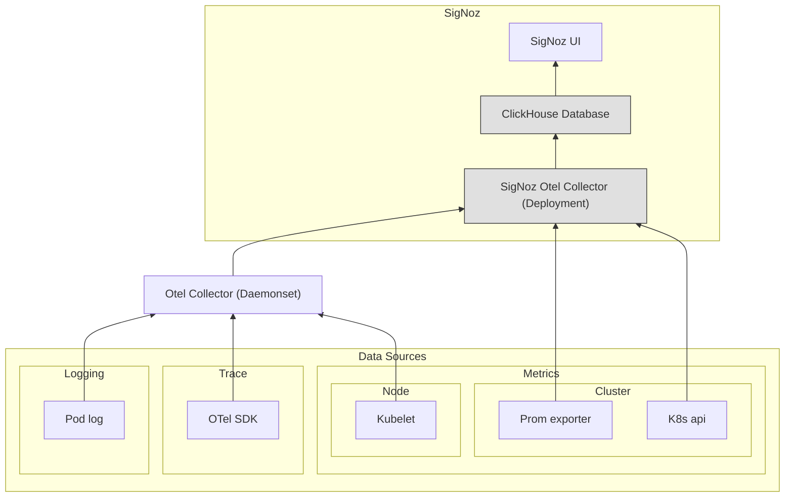

```mermaid
---
config:
  layout: dagre
---
flowchart BT
 subgraph subGraph0["SigNoz"]
    direction TB
        A["SigNoz UI"]
        B["ClickHouse Database"]
        C["SigNoz Otel Collector (Deployment)"]
  end
 subgraph Logging["Logging"]
        L["Pod log"]
  end
 subgraph Trace["Trace"]
        T["OTel SDK"]
  end
 subgraph Node["Node"]
        K["Kubelet"]
  end
 subgraph Cluster["Cluster"]
        P["Prom exporter"]
        K8["K8s api"]
  end
 subgraph Metrics["Metrics"]
        Node
        Cluster
  end
 subgraph subGraph6["Data Sources"]
        Logging
        Trace
        Metrics
  end
    C --> B
    B --> A
    D["Otel Collector (Daemonset)"] --> C
    L --> D
    T --> D
    K --> D
    P --> C
    K8 --> C
    style B fill:#E0E0E0,stroke:#333
    style C fill:#E0E0E0,stroke:#333

```

