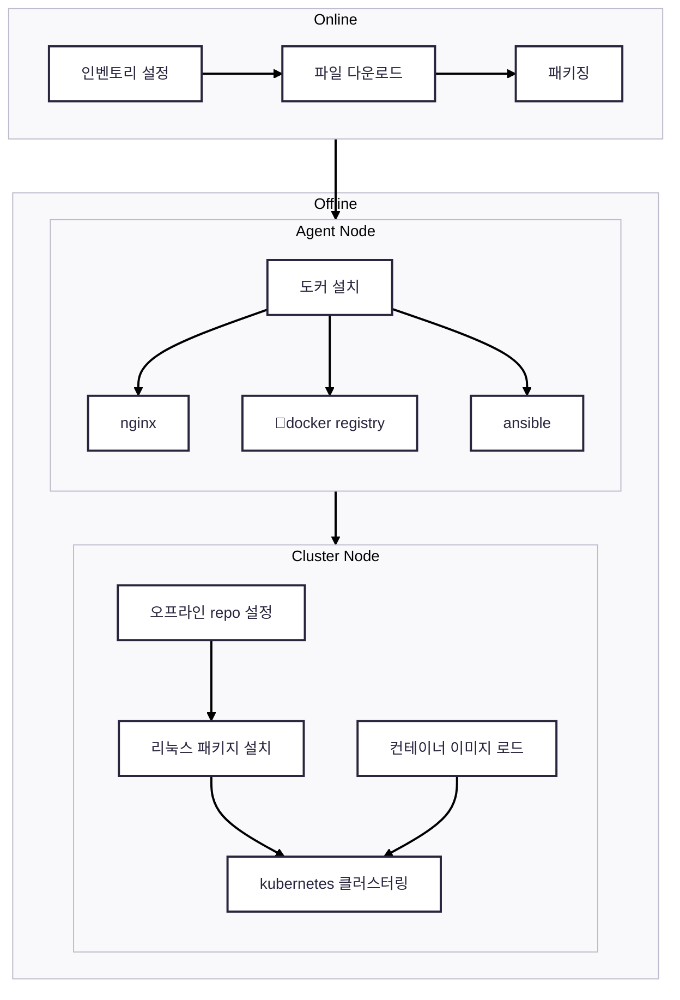

## 온라인 환경
### 사전
- ansible inventory 구성
- plugin component config 구성

### 패키징
- 패키지 준비 (linux package, container image, kubernetes binary)
- 패킹 (packages, script, plugin component helm charts)

## 오프라인 환경
### 에이전트 노드 셋업
- containerd 설치
- nginx 컨테이너 실행 (linux package, container image, kubernetes binary)
- docker registry 실행 (kubespray image)
	- 사전에 노드에 이미지 load 상태면 레지스트리 준비안해도 되는지 확인 필요
- ansible 컨테이너
	- sleep 99d
	- dind 필요여부 확인

### 클러스터링
- 오프라인 repo 설정
- 리눅스 패키지 설치
- 컨테이너 이미지 로드
- kubespray 클러스터링
- (taint 제거)
- 플러그인 컴포넌트 설치
