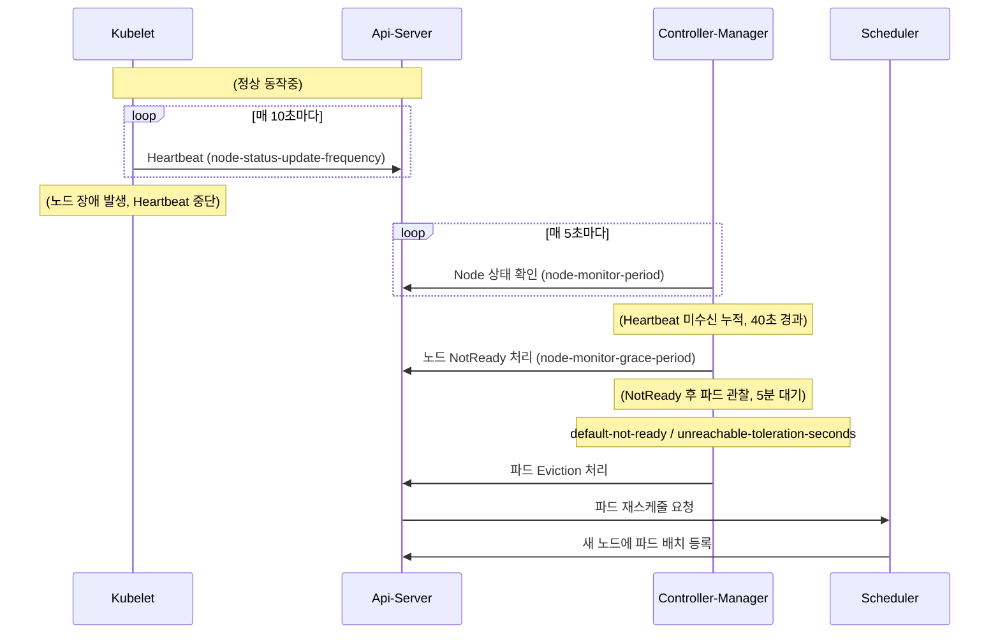

## 요약

> [!SUMMARY]
> 워커 2대짜리 클러스터에서 노드 하나가 죽으면 파드가 다른 노드로 재스케줄될 때까지 기본값 기준 약 6분이 걸렸다. 이 6분의 대부분이 어디서 나오는지 타임라인을 뜯어보니 5분짜리 toleration이 범인이었다. kubelet의 heartbeat 주기, controller-manager의 grace period, api-server의 toleration seconds를 조정해 파드 재생성이 30초 안쪽에 시작되고 서비스가 약 1분 내로 돌아오게 만들었다.

노드가 죽었을 때 6분 동안 아무 일도 안 일어난다는 건, 워커가 2대뿐인 환경에선 서비스 절반이 6분간 죽어 있다는 뜻이다. 처음엔 "쿠버네티스가 알아서 옮겨주겠지" 하고 지켜봤는데 한참을 기다려도 파드가 안 옮겨가서, 대체 왜 이렇게 오래 걸리나 싶어 기본 동작을 뜯어봤다. 결론부터 말하면 기본값은 <b>대규모 클러스터에서 순간적인 네트워크 끊김에 과민반응하지 않도록</b> 넉넉하게 잡혀 있다. 노드 2대짜리한테는 과하게 넉넉했다.

## 1. 왜 6분이나 걸리나

노드가 죽고 나서 파드가 다른 노드에 다시 뜨기까지, 실제로는 여러 컴포넌트가 릴레이로 판단을 넘긴다. 순서는 이렇다.



각 단계의 기본값을 숫자로 늘어놓으면 6분이 어디서 나오는지 바로 보인다.

- <b>kubelet</b>이 자기 상태를 api-server에 보고하는 주기: `node-status-update-frequency=10s`
- <b>kube-controller-manager</b>가 노드 상태를 들여다보는 주기: `node-monitor-period=5s`
- heartbeat가 끊긴 뒤 노드를 `NotReady`로 찍기까지 기다리는 시간: `node-monitor-grace-period=40s`
- `NotReady`/`Unreachable` 노드에 얹힌 파드를 축출(Eviction)하지 않고 버텨주는 시간: `default-not-ready-toleration-seconds` / `default-unreachable-toleration-seconds` = 각 `5m`

그러니까 대략 `40초(NotReady 판정) + 5분(toleration) = 5분 40초`, 여기에 재스케줄과 파드 기동 시간이 붙어 약 6분이다. 눈여겨볼 건 이 6분의 거의 전부가 <b>마지막 5분짜리 toleration</b>이라는 점이다. 앞의 grace period 40초를 아무리 줄여봐야 5분 앞에선 반올림 오차다. 손댈 곳이 명확해졌다.

> [!NOTE]
> toleration seconds가 왜 기본 5분이나 되냐면, 이 값은 원래 순간적인 네트워크 단절이나 api-server 부하로 노드가 잠깐 `NotReady`로 깜빡이는 상황에서 멀쩡한 파드를 성급하게 죽이지 않으려고 있는 완충 장치다. 노드가 수백 대인 클러스터라면 이 완충이 파드 대량 축출을 막아준다. 노드 2대짜리한텐 그 완충이 곧 다운타임이었다.

## 2. 조정한 파라미터

큰 레버는 toleration seconds지만, 앞단도 같이 조여야 전체 시간이 자연스럽게 줄어든다. 실제로 바꾼 값은 이렇다.

- <b>kubelet</b>
  - `--node-status-update-frequency=5s` (기본 10s): heartbeat를 더 자주 보내 장애를 빨리 전파한다.
- <b>kube-controller-manager</b>
  - `--node-monitor-period=5s` (기본 5s): 그대로 뒀다. 이미 촘촘하다.
  - `--node-monitor-grace-period=20s` (기본 40s): `NotReady` 판정을 40초에서 20초로 당겼다.
- <b>kube-apiserver</b>
  - `--default-not-ready-toleration-seconds=5` (기본 5m)
  - `--default-unreachable-toleration-seconds=5` (기본 5m): 5분짜리 완충을 5초로 잘라냈다. 여기가 제일 크게 먹혔다.

grace period를 20초로 잡을 때 한 가지는 신경 썼다. 이 값은 heartbeat 주기의 넉넉한 배수여야 한다. heartbeat가 두어 번 유실됐다고 바로 `NotReady`로 찍으면, 진짜 장애가 아니라 순간적인 지연에도 노드가 오락가락한다. 기본값이 `40s / 10s = 4배`인데, 나도 `20s / 5s = 4배`로 같은 비율을 유지했다. 감지는 빨라지되 민감도 비율은 기본값과 동일하게 둔 셈이다.

> [!IMPORTANT]
> 예전엔 이 축출 대기를 controller-manager의 `--pod-eviction-timeout` 하나로 잡았는데, 지금은 api-server의 `TolerationSeconds` 계열 옵션으로 기능이 넘어갔다. 오래된 블로그를 보고 `--pod-eviction-timeout`만 만졌다가 "왜 안 줄지?" 하고 헤매기 쉬운 지점이다. 실제 동작하는 건 toleration seconds 쪽이다.

## 3. 적용

컨트롤플레인 컴포넌트는 static pod로 관리되니, 마스터 노드의 매니페스트 파일에 옵션만 추가하면 kubelet이 알아서 파드를 다시 띄운다.

api-server는 `/etc/kubernetes/manifests/kube-apiserver.yaml`의 커맨드에 옵션을 얹는다. toleration seconds를 실제로 먹이려면 `DefaultTolerationSeconds` admission plugin이 켜져 있어야 한다.

```yaml
# spec.containers[].command 에 추가
- --enable-admission-plugins=DefaultTolerationSeconds
- --default-not-ready-toleration-seconds=5
- --default-unreachable-toleration-seconds=5
```

controller-manager는 `/etc/kubernetes/manifests/kube-controller-manager.yaml`에 grace period를 추가한다.

```yaml
# spec.containers[].command 에 추가
- --node-monitor-period=5s
- --node-monitor-grace-period=20s
```

kubelet의 `--node-status-update-frequency`는 static pod가 아니라 노드마다 도는 데몬이라, kubelet 설정(`/var/lib/kubelet/config.yaml` 또는 기동 플래그)에 넣고 kubelet을 재시작해야 반영된다. 여기만 적용 방식이 다르다는 걸 놓치면, 컨트롤플레인만 조여놓고 정작 감지 첫 단추인 heartbeat는 10초 그대로 도는 상태가 된다.

## 4. 트레이드오프와 확인

값을 줄인 만큼 클러스터가 예민해진다. 이건 공짜가 아니다.

- toleration을 5초로 잘랐으니, 노드가 진짜로 죽은 게 아니라 잠깐 네트워크가 끊기거나 부하로 heartbeat가 밀린 경우에도 파드를 축출하고 재스케줄한다. 불필요한 파드 재기동이 늘 수 있다.
- heartbeat 주기를 5초로 줄이면 그만큼 api-server·etcd에 노드 상태 write가 잦아진다. 노드가 수백 대라면 이 write 부하 자체가 문제가 되지만, 2대 규모에선 무시할 만했다.

이 튜닝은 오탐으로 인한 약간의 파드 재기동을 감수하고 장애 시 다운타임을 줄이는 맞바꿈이다. 노드가 2대뿐이라 한 대만 나가도 가용 자원이 절반 날아가는 환경에선, 6분 다운타임보다 가끔 있는 오탐 재기동이 훨씬 싸다고 봤다. 노드 수십 대짜리 대규모 클러스터라면 나는 이렇게까지 공격적으로는 안 줄일 것 같다.

적용 뒤 워커 한 대를 강제로 내려(전원/네트워크 차단) 실측했다. `kubectl get nodes`에서 노드가 `NotReady`로 넘어가는 데 20초 남짓, 파드 재생성이 시작되는 게 30초 안쪽, 이미지가 이미 노드에 있는 파드는 약 1분 안에 `Running`으로 돌아왔다. 기본 6분과 비교하면 다운타임이 확연히 줄었다.

```bash
# 노드를 내린 직후 상태 전이를 추적한다. NotReady → 파드 Terminating/재스케줄 순서를 눈으로 확인.
watch -n1 'kubectl get nodes; echo ---; kubectl get pods -o wide'
```

한 가지 덧붙이면, 감지 시간을 줄여도 파드가 실제로 다른 노드에서 뜨려면 그쪽에 자원 여유와(레플리카·토폴로지 분산) 볼륨이 붙을 수 있어야 한다. 파라미터 튜닝은 "언제 옮길지"를 당길 뿐, "옮길 수 있는지"는 별개다. 그쪽 이야기는 [[2node-cluster-ha-and-failover|2-Node HA 구성 글]]에 따로 정리해뒀다.

## 참고

- [Kubernetes Docs: Node lifecycle / heartbeats](https://kubernetes.io/docs/concepts/architecture/nodes/#heartbeats)
- [Kubernetes Docs: Taint based Evictions](https://kubernetes.io/docs/concepts/scheduling-eviction/taint-and-toleration/#taint-based-evictions)
- [[2node-cluster-ha-and-failover|Kubernetes 2-Node 클러스터에서 고가용성(HA) 및 장애 복구(Failover) 구성하기]]
