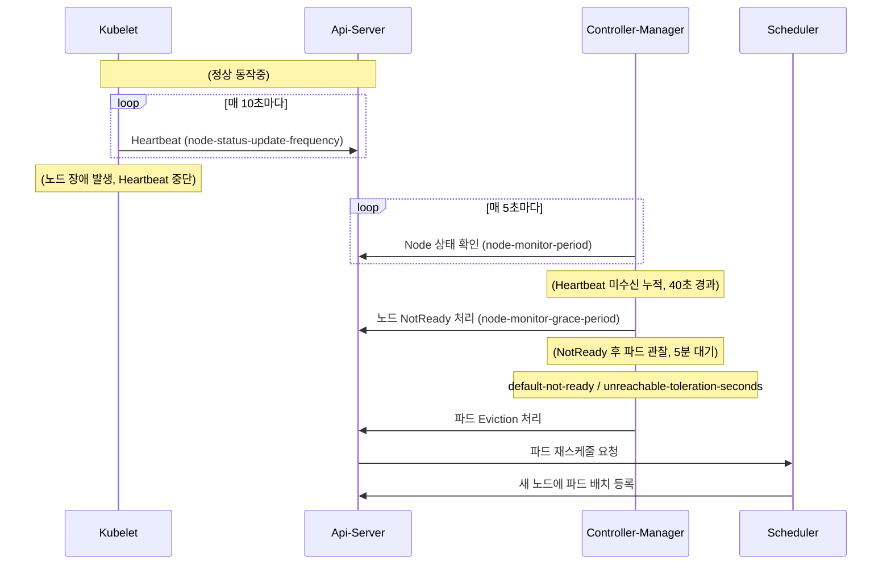

## 요약

> [!SUMMARY]
> 워커 2대짜리 클러스터에서 노드 하나가 죽으면 파드가 다른 노드로 재스케줄될 때까지 기본값 기준 약 6분이 걸렸다. 이 6분의 대부분이 어디서 나오는지 타임라인을 분석해 보니 5분짜리 toleration이 원인이었다. kubelet의 heartbeat 주기, controller-manager의 grace period, api-server의 toleration seconds를 조정해서 파드 재생성이 30초 안쪽에 시작되고 서비스가 약 1분 이내로 돌아오게 만들었다.

노드가 죽었을 때 6분 동안 아무 일도 일어나지 않는다는 것은, 워커가 2대뿐인 환경에서는 서비스 절반이 6분간 중단 상태로 유지된다는 의미다. 처음에는 "쿠버네티스가 알아서 옮겨주겠지" 하고 지켜보았지만 한참을 기다려도 파드가 옮겨가지 않아서, 왜 이렇게 오래 걸리는지 궁금해 기본 동작을 분석했다. 결론부터 말하면 기본값은 <b>대규모 클러스터에서 순간적인 네트워크 끊김에 과민반응하지 않도록</b> 넉넉하게 설정되어 있다. 노드 2대짜리 환경에는 과하게 넉넉한 값이었다.

## 1. 왜 6분이나 걸리는가

노드가 죽고 나서 파드가 다른 노드에서 다시 기동되기까지, 실제로는 여러 컴포넌트가 순차적으로 판단을 넘겨 처리한다. 순서는 아래와 같다.



각 단계의 기본값을 수치로 나열하면 6분이 어디서 나오는지 바로 확인할 수 있다.

- <b>kubelet</b>이 자기 상태를 api-server에 보고하는 주기: `node-status-update-frequency=10s`
- <b>kube-controller-manager</b>가 노드 상태를 들여다보는 주기: `node-monitor-period=5s`
- heartbeat가 끊긴 뒤 노드를 `NotReady`로 찍기까지 기다리는 시간: `node-monitor-grace-period=40s`
- `NotReady`/`Unreachable` 노드에 남아 있는 파드를 축출(Eviction)하지 않고 버텨 주는 시간: `default-not-ready-toleration-seconds` / `default-unreachable-toleration-seconds` = 각각 `5m`

즉 대략 `40초(NotReady 판정) + 5분(toleration) = 5분 40초`이고, 여기에 재스케줄과 파드 기동 시간이 더해져 약 6분이다. 주목할 점은 이 6분의 거의 전부가 <b>마지막 5분짜리 toleration</b>이라는 것이다. 앞의 grace period 40초를 아무리 줄여봐야 5분 앞에서는 반올림 오차 수준이다. 수정할 곳이 명확해졌다.

> [!NOTE]
> toleration seconds가 왜 기본값이 5분이나 되는가 하면, 이 값은 원래 순간적인 네트워크 단절이나 api-server 부하로 인해 노드가 잠깐 `NotReady` 상태를 보이는 상황에서 정상적인 파드를 성급하게 종료하지 않기 위해 존재하는 완충 장치다. 노드가 수백 대인 클러스터라면 이 완충이 파드 대량 축출을 막아 준다. 하지만 노드 2대짜리 환경에서는 그 완충이 곧 다운타임이었다.

## 2. 조정한 파라미터

가장 큰 영향을 주는 값은 toleration seconds지만, 앞 단계도 함께 조여야 전체 시간이 자연스럽게 줄어든다. 실제로 변경한 값은 아래와 같다.

- <b>kubelet</b>
  - `--node-status-update-frequency=5s` (기본값 10s): heartbeat를 더 자주 전송해서 장애를 빠르게 전파한다.
- <b>kube-controller-manager</b>
  - `--node-monitor-period=5s` (기본값 5s): 그대로 두었다. 이미 촘촘한 값이다.
  - `--node-monitor-grace-period=20s` (기본값 40s): `NotReady` 판정을 40초에서 20초로 당겼다.
- <b>kube-apiserver</b>
  - `--default-not-ready-toleration-seconds=5` (기본 5m)
  - `--default-unreachable-toleration-seconds=5` (기본 5m): 5분짜리 완충을 5초로 잘라냈다. 여기가 제일 크게 먹혔다.

grace period를 20초로 설정할 때 한 가지를 신경 썼다. 이 값은 heartbeat 주기의 넉넉한 배수여야 한다. heartbeat가 두어 번 유실되었다고 바로 `NotReady`로 판정하면, 진짜 장애가 아니라 순간적인 지연에도 노드 상태가 오락가락한다. 기본값이 `40s / 10s = 4배`이므로, 나도 `20s / 5s = 4배`로 같은 비율을 유지했다. 감지 속도는 빨라지되 민감도 비율은 기본값과 동일하게 둔 셈이다.

> [!IMPORTANT]
> 예전에는 이 축출 대기를 controller-manager의 `--pod-eviction-timeout` 하나로 설정했는데, 지금은 api-server의 `TolerationSeconds` 계열 옵션으로 기능이 이전되었다. 오래된 블로그 글을 참고해서 `--pod-eviction-timeout`만 수정하다가 "왜 시간이 줄지 않는가?" 하고 헤매기 쉬운 지점이다. 실제로 동작하는 것은 toleration seconds 쪽이다.

## 3. 적용

컨트롤플레인 컴포넌트는 static pod로 관리되므로, 마스터 노드의 매니페스트 파일에 옵션만 추가하면 kubelet이 자동으로 파드를 다시 띄운다.

api-server는 `/etc/kubernetes/manifests/kube-apiserver.yaml`의 커맨드에 옵션을 추가한다. toleration seconds를 실제로 적용하려면 `DefaultTolerationSeconds` admission plugin이 활성화되어 있어야 한다.

```yaml
# spec.containers[].command 에 추가
- --enable-admission-plugins=DefaultTolerationSeconds
- --default-not-ready-toleration-seconds=5
- --default-unreachable-toleration-seconds=5
```

controller-manager는 `/etc/kubernetes/manifests/kube-controller-manager.yaml`에 grace period를 추가한다.

```yaml
# spec.containers[].command 에 추가
- --node-monitor-period=5s
- --node-monitor-grace-period=20s
```

kubelet의 `--node-status-update-frequency`는 static pod가 아니라 노드마다 실행되는 데몬이므로, kubelet 설정(`/var/lib/kubelet/config.yaml` 또는 기동 플래그)에 넣고 kubelet을 재시작해야 반영된다. 여기만 적용 방식이 다르다는 사실을 놓치면, 컨트롤플레인만 조여 놓고 정작 감지의 첫 단계인 heartbeat는 10초 그대로 동작하는 상태가 된다.

## 4. 트레이드오프와 확인

값을 줄인 만큼 클러스터가 예민해진다. 이것은 공짜가 아니다.

- toleration을 5초로 줄였으므로, 노드가 실제로 죽은 것이 아니라 잠깐 네트워크가 끊기거나 부하 때문에 heartbeat가 밀린 경우에도 파드를 축출하고 재스케줄한다. 불필요한 파드 재기동이 늘어날 수 있다.
- heartbeat 주기를 5초로 줄이면 그만큼 api-server와 etcd에 대한 노드 상태 write가 잦아진다. 노드가 수백 대라면 이 write 부하 자체가 문제가 되지만, 2대 규모에서는 무시할 만했다.

이 튜닝은 오탐으로 인한 약간의 파드 재기동을 감수하고 장애 시 다운타임을 줄이는 교환 관계다. 노드가 2대뿐이라 한 대만 나가도 가용 자원이 절반 사라지는 환경에서는, 6분 다운타임보다 가끔 발생하는 오탐 재기동이 훨씬 저렴하다고 판단했다. 노드가 수십 대인 대규모 클러스터라면 나는 여기까지 공격적으로 줄이지 않을 것 같다.

적용 후 워커 한 대를 강제로 내리고(전원/네트워크 차단) 실측했다. `kubectl get nodes`에서 노드가 `NotReady` 상태로 넘어가는 데 20초 남짓 걸렸고, 파드 재생성이 시작되는 것은 30초 안쪽이었다. 이미지가 이미 노드에 존재하는 파드는 약 1분 안에 `Running` 상태로 돌아왔다. 기본값 6분과 비교하면 다운타임이 확연히 줄었다.

```bash
# 노드를 내린 직후 상태 전이를 추적한다. NotReady → 파드 Terminating/재스케줄 순서를 눈으로 확인.
watch -n1 'kubectl get nodes; echo ---; kubectl get pods -o wide'
```

한 가지 덧붙이면, 감지 시간을 줄여도 파드가 실제로 다른 노드에서 기동되려면 그쪽에 자원 여유(레플리카·토폴로지 분산 포함)와 볼륨 연결 가능성이 있어야 한다. 파라미터 튜닝은 "언제 옮길지"를 앞당길 뿐, "옮길 수 있는지"는 별개 문제다. 그 내용은 [[2node-cluster-ha-and-failover|2-Node HA 구성 글]]에 따로 정리해 두었다.

## 참고

- [Kubernetes Docs: Node lifecycle / heartbeats](https://kubernetes.io/docs/concepts/architecture/nodes/#heartbeats)
- [Kubernetes Docs: Taint based Evictions](https://kubernetes.io/docs/concepts/scheduling-eviction/taint-and-toleration/#taint-based-evictions)
- [[2node-cluster-ha-and-failover|Kubernetes 2-Node 클러스터에서 고가용성(HA) 및 장애 복구(Failover) 구성하기]]
