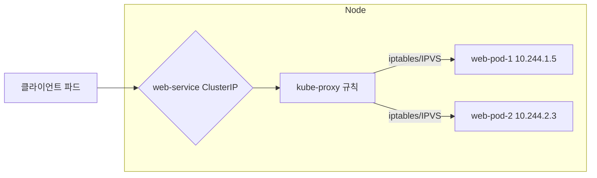

> [!SUMMARY]
> 서비스(Service)는 레이블 셀렉터(Label Selector)로 특정 파드(Pod)들을 골라내고, 그 파드들의 IP·포트를 EndpointSlice에 모아 관리한다. 서비스 IP로 요청이 오면 각 노드의 kube-proxy가 이 목록을 보고 실제 파드로 트래픽을 넘긴다.

## 1. 서비스가 필요한 이유

파드는 일시적인 자원이다. 장애, 스케일링, 업데이트 같은 이유로 언제든 재생성되거나 삭제되고, 그때마다 IP가 새로 붙는다. 그래서 파드 IP를 직접 참조하면 파드가 교체될 때마다 연결이 끊긴다.

<b>서비스(Service)</b>는 파드 집합에 고정된 IP(ClusterIP)와 DNS 이름을 붙여주는 추상화다. 파드가 바뀌어도 클라이언트는 늘 같은 주소로 접근할 수 있다.

## 2. 서비스가 파드를 찾는 방식

서비스가 자기 뒤에 붙일 파드를 어떻게 고르는지가 핵심이다. 그 중심에 <b>레이블 셀렉터(Label Selector)</b>가 있다.

### 2-1. 레이블 셀렉터 매칭

서비스는 `selector`에 적힌 레이블을 기준으로, 같은 레이블을 가진 파드를 백엔드로 삼는다.

아래는 `app: web`, `tier: frontend` 레이블을 가진 파드를 고르는 서비스다.

```yaml
# 'app: web', 'tier: frontend' 레이블을 가진 파드를 고른다
apiVersion: v1
kind: Service
metadata:
  name: web-service
spec:
  selector:
    app: web
    tier: frontend
  ports:
  - protocol: TCP
    port: 80        # 서비스가 노출할 포트
    targetPort: 8080 # 트래픽을 전달할 파드의 컨테이너 포트
```

이 서비스에 붙으려면 파드는 `metadata.labels`에 해당 레이블을 모두 가지고 있어야 한다.

```yaml
# 위 서비스의 selector와 일치하는 파드
apiVersion: v1
kind: Pod
metadata:
  name: web-pod
  labels:
    app: web
    tier: frontend
spec:
  containers:
  - name: web-container
    image: nginx
    ports:
    - containerPort: 8080
```

### 2-2. EndpointSlice로 이어지는 과정

서비스와 파드를 잇는 실제 작업은 컨트롤러가 자동으로 한다.

1. 서비스 매니페스트를 API 서버에 제출한다.
2. 컨트롤러가 서비스의 `selector`와 일치하는 파드를 클러스터에서 찾는다.
3. 찾은 파드들의 IP와 포트를 <b>EndpointSlice</b> 오브젝트에 기록한다.
4. 이후에도 파드가 뜨고 지고 레이블이 바뀔 때마다 EndpointSlice를 최신 상태로 갱신한다.

```yaml
# web-service에 연결된 파드들의 IP·포트를 담는다
apiVersion: discovery.k8s.io/v1
kind: EndpointSlice
metadata:
  name: web-service-abcde
  labels:
    kubernetes.io/service-name: web-service # 어떤 서비스에 속하는지 표시
addressType: IPv4
ports:
- protocol: TCP
  port: 8080
endpoints:
- addresses:
  - "10.244.1.5"
- addresses:
  - "10.244.2.3"
```

> [!NOTE]
> 예전에는 파드 IP를 하나의 `Endpoints` 오브젝트에 몰아 담았는데, 지금은 이 방식이 deprecated 됐고 여러 개로 나눠 담는 EndpointSlice가 표준이다. 서비스가 많아지고 엔드포인트가 늘어날 때 부담을 줄이려는 구조다. 오래된 클러스터나 문서에서는 아직 `Endpoints`라는 이름을 볼 수 있다.

## 3. kube-proxy와 트래픽 라우팅

서비스 개념을 실제로 구현하는 건 <b>kube-proxy</b>다. 클러스터의 모든 노드에서 돌면서 서비스 IP와 파드 IP를 매핑하고, 라우팅 규칙을 관리하고, 파드로 향하는 트래픽을 로드 밸런싱한다. 서비스 IP(ClusterIP)는 실제 인터페이스가 없는 가상 IP라, 이 규칙이 없으면 아무 데도 닿지 않는다.



1. 클라이언트가 서비스의 ClusterIP로 요청을 보낸다.
2. kube-proxy가 EndpointSlice로 실제 파드 IP 목록을 이미 알고 있다.
3. 이 목록을 바탕으로 `iptables`·`IPVS`(최신 버전은 `nftables`도) 규칙을 걸어 요청을 백엔드 파드 중 하나로 넘긴다. 이때 로드 밸런싱이 이뤄진다. iptables 모드는 순번대로가 아니라 확률적으로(랜덤) 고르고, IPVS는 기본이 라운드 로빈이다.

> [!INFO]
> kube-proxy는 이름과 달리 트래픽을 직접 받아 넘기는 프록시 서버가 아니다. 커널의 넷필터(Netfilter)를 이용해 패킷의 목적지 주소를 바꾸는(DNAT) 규칙을 심어두는 쪽에 가깝다.

## 4. kube-proxy 없이 동작시키기

kube-proxy 대신 CNI가 서비스 라우팅을 맡을 수도 있다. Cilium을 쓰면 agent 안의 eBPF 데이터플레인으로 kube-proxy 기능을 대체한다.

- kube-proxy 컴포넌트를 아예 안 깔아도 된다.
- iptables·IPVS 규칙에 대한 의존을 없앨 수 있다. iptables 정책이 꼬여 서비스 통신이 깨지는 상황 자체를 피할 수 있다.
- eBPF는 커널 레벨 패킷 처리라 iptables·IPVS보다 빠르고, 서비스·엔드포인트가 많아져도 성능 저하가 덜하다.
- 로드 밸런싱 옵션, 클라이언트 IP 보존, DSR 같은 기능도 지원한다.

## 5. 연결이 안 될 때 점검

서비스가 붙지 않을 때 가장 흔한 원인은 레이블 불일치다. `selector`와 파드 `labels`가 정확히 맞는지부터 본다.

```bash
# 1. 서비스의 selector와 할당된 IP 확인
kubectl describe svc web-service

# 2. 서비스에 연결된 엔드포인트 확인. 비어 있으면 매칭되는 파드가 없다는 뜻이다.
kubectl get endpointslices -l kubernetes.io/service-name=web-service

# 3. 파드 레이블 직접 확인
kubectl get pods --show-labels
```

주로 이 셋을 본다.

- 서비스 `selector`와 파드 `labels`가 일치하는가?
- 서비스 `targetPort`가 파드의 `containerPort`와 맞는가?
- 파드가 `Running`, `Ready`인가?

## 6. 서비스 타입

노출 방식에 따라 타입이 나뉜다.

- <b>ClusterIP</b>: 기본값. 클러스터 내부에서만 닿는 가상 IP를 준다.
- <b>NodePort</b>: ClusterIP에 더해, 모든 노드의 특정 포트(기본 범위 30000-32767)로 외부에서 접근하게 해준다. `<NodeIP>:<NodePort>`로 붙는다.
- <b>LoadBalancer</b>: NodePort에 더해, 클라우드의 외부 로드 밸런서를 프로비저닝해 붙인다. 외부 IP가 생겨 밖에서 바로 접근한다.
- <b>ExternalName</b>: 클러스터 밖 서비스를 DNS CNAME으로 매핑해 내부 서비스처럼 별칭으로 쓴다.

## 참고

- [Kubernetes Service 공식 문서](https://kubernetes.io/docs/concepts/services-networking/service/)
- [EndpointSlices](https://kubernetes.io/docs/concepts/services-networking/endpoint-slices/)
- [Virtual IPs and Service Proxies](https://kubernetes.io/docs/reference/networking/virtual-ips/)
